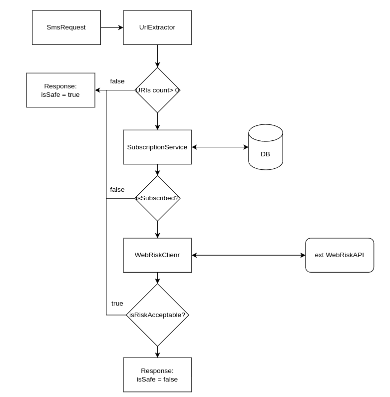

# Getting Started

### Assumptions

#### 1. URL extraction 
The application is meant to handle most common URL protocols i.e:
- http
- https
- ftp
- file

Other protocols considered but not implemented to keep application simple, app can be extended if needed:
- javascript: – Can execute arbitrary code if rendered in a vulnerable environment.
- data: – Used for payload hiding, phishing forms, fake UI.
- mailto: – Used in social engineering ("Click to report password reset").
- tel: – Can initiate premium-rate calls or social engineering on phones.
- intent: – Used on Android to launch or link to malicious apps.

URLs hidden inside the text are not going to be found, for example: "Hi, visit<b>https://stealpassword.com</b>and...", "<<https://stealpassword.com>>". It might be a valid point for further improvements.


### 2. Failures.
- In case of external client failure, DB connection failure or any other internal error, the 500 error message is returned.

### 3. API


**POST** `/api/sms/check-phishing`

Checks whether a given SMS message is considered phishing or safe, using an external verification service.

---

### ✅ Request

**Content-Type:** `application/json`

### Request Body

```json
{
  "sender": "123456789",
  "recipient": "987654321",
  "message": "Hello, check this link: http://example.com"
}
```

### ✅ Response

Status: 200 OK

### Response Body
```json
{
  "safe": false,
  "reason": "SOCIAL_ENGINEERING"
}
```


**POST** `/api/sms/subscribe`

Enables feature for the user with given phone number.

### Request Body

```json
{
  "phoneNumber": "123456789"
}
```

### ✅ Response

Status: 200 OK

### Response Body
Empty

**POST** `/api/sms/unsubscribe`

Enables feature for the user with given phone number.

### Request Body

```json
{
  "phoneNumber": "123456789"
}
```

### ✅ Response

Status: 200 OK

### Response Body
Empty


### ❌ Error Responses 

Each endpoint returns the same error response like:
```json
{
  "error": "Internal error..."
}
```
**Status: 500 Internal Server Error**

## 4. Workflow



## 5. Running and testing the app

Make sure you are using Java 21.

Application utilizes JOOQ to communicate with database.

1. Run `setup.sh` to initialize postgres DB and generate JOOQ classes. Classes should be present in 
`./target/generated-sources/jooq`.
2. You can run spring boot tests. Tests utilizes Testcontainers and WireMock.
3. You can't test `api/sms/check-fishing` endpoint with Postman. External service is not accessible. No separate container is implemented for that case. 

Creating a .jar. 
1. `setup.sh`
2. `mvn clean install`

## 6. Dockerfile & deployment

You can run the application by invoking `docker compose up` in a root directory. (Don't forget to generate a .jar before).

Note: Real url and api-key to WebRisk API is not configured in `compose.yml`. Didn't want to spend money on it.